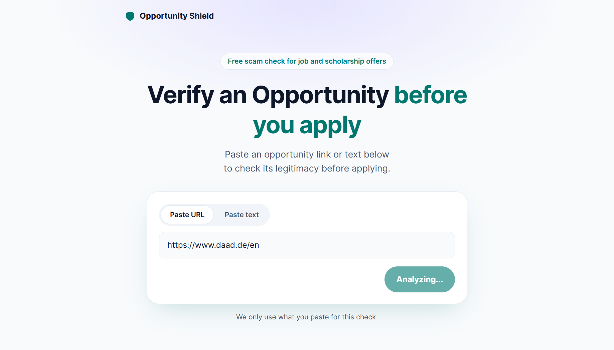
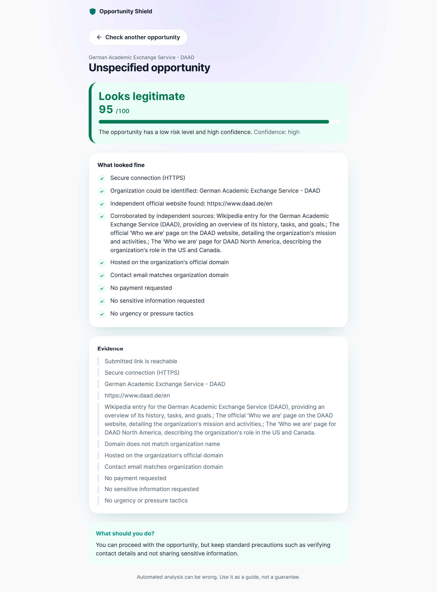

# Opportunity Shield

## Overview

- [Features](#features)
- [How It Works](#how-it-works)
- [Tech Stack](#tech-stack)
- [Getting Started](#getting-started)
- [API Integration](#api-integration)
- [Screenshots](#screenshots)

## Features

- **URL verification** — Submit an opportunity URL for analysis.
- **Text verification** — Analyze opportunity messages, emails, or descriptions.
- **Risk assessment** — Receive a risk level based on detected signals.
- **Trust score** — View a trust score when sufficient information is available.
- **Positive and warning signals, and evidence** — Understand what influenced the analysis.
- **Analysis progress** — See the verification process as it happens.
- **Recommendations** — Receive guidance based on the analysis.

## How It Works

1. Paste a URL or text message/email into the input field on the homepage.
2. Click **Analyze**.
3. The application navigates to a result page and displays the progress of the verification.
4. Once the analysis is complete, the result page displays information about the opportunity, including its risk level, confidence, signals, and recommendation.

## Tech Stack

- **Frontend:** React + TypeScript
- **Styling:** [Tailwind CSS](https://tailwindcss.com/)
- **Icons:** [Lucide React](https://lucide.dev/guide/react/)
- **Routing:** [React Router DOM](https://www.npmjs.com/package/react-router-dom)

## Getting Started

### 1. Clone the repository

```bash
git clone <repository-url>
cd opportunity-shield-frontend
```

### 2. Install dependencies

```bash
npm install
```

### 3. Start the development server

```
npm run dev
```

## API Integration

The application uses an asynchronous analysis flow:

```text
User submits URL/text
        ↓
POST /api/v1/analyses
        ↓
Receive analysisId
        ↓
Navigate to result page
        ↓
Poll GET /api/v1/analyses/{id}
        ↓
Show analysis progress
        ↓
Receive completed result
        ↓
Display risk assessment
```

## Screenshots

### Homepage



### Analysis result


